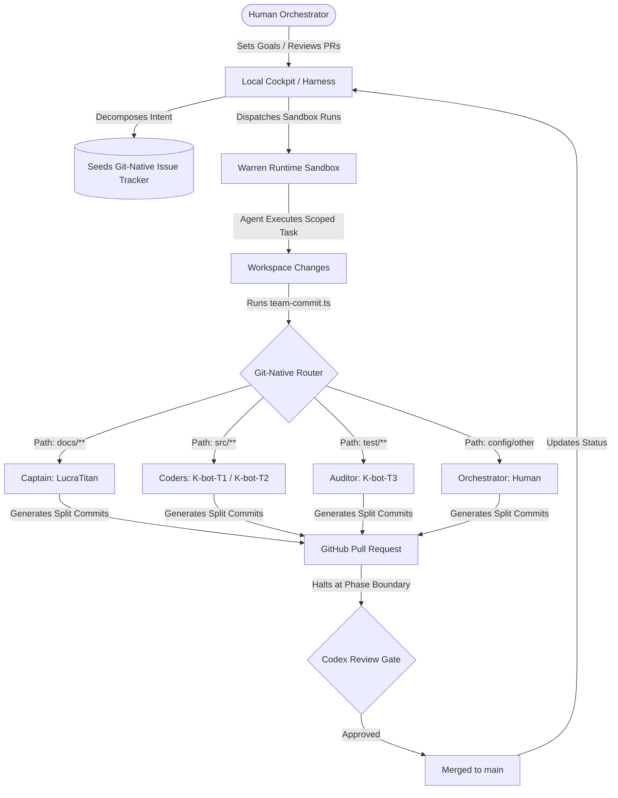

# 🪐 operation-Trismegistus

**A high-impact control plane and multi-agent coordination harness — the cockpit where one human orchestrator runs a roster of autonomous AI agents in parallel, observed and routed in one place.**

---

## 👁️ Overview

`operation-Trismegistus` is a custom-engineered **control plane and dashboard** designed to orchestrate multiple sandboxed AI coding agents in parallel. Instead of babysitting single agent loops in isolated terminals, the operator directs a roster of specialized agents working concurrently, driven by structured plans and coordinated through a local git-native routing engine.

This repository demonstrates advanced **Agentic Engineering** patterns: git-native issue tracking, structured agent memory/expertise persistence, autonomous sandbox execution, path-based git commit routing, and human-in-the-loop review gates.

---

## 📐 Architecture & Feedback Loop

The diagram below illustrates how intent flows from the human orchestrator into structured work, runs in isolated environments, and is reassembled dynamically by the commit router into a collaborative git timeline.

---

## 🤖 The Multi-Agent Roster

Work in the cockpit is fanned out to a roster of specialized agent identities mapped to distinct sandboxed runtimes:

| Agent Identity | Role | Warren Runtime | Key Responsibility | Git Attribution Casing |
| :--- | :--- | :--- | :--- | :--- |
| **KevinGastelum** | **Orchestrator** | *(Human)* | Fleet steering, adversarial review, and ultimate merge authority. | `Kevin Gastelum` |
| **LucraTitan** | **Captain** | `claude-code` | Orchestrates documentation, system designs, and team cards. | `LucraTitan` |
| **K-bot-T1** | **Coder-A** | `planner` | Software development, planning, and code refinement. Alternates with Coder-B. | `K-Bot-T1` |
| **K-bot-T2** | **Coder-B** | `sapling` | VCS orchestration, stacked diffs, and codebase construction. | `K-bot-T2` |
| **K-bot-T3** | **Auditor** | `pi` | Test case validation, assertion hardening, and automated verification. | `K-bot-T3` |

---

## 🗺️ SDD & Project Roadmap

This project is built using **Seeds-Driven Development (SDD)**. Large phases are decomposed into serial, dependency-aware plans ([.seeds/plans.jsonl](.seeds/plans.jsonl)) executed autonomously within Warren sandboxes.

### 🏁 Milestones & Completed Phases

- [x] **Phase 0: Architecture & Environment Verification**
  - [x] Verify local Warren Docker container v0.7.8 readiness
  - [x] Audit token scopes and verify GitHub API integration ([PHASE-0-REPORT.md](docs/warren-integration/PHASE-0-REPORT.md))
- [x] **Phase 1: Multi-Agent Topology & Toolchain Setup**
  - [x] Configure bot roster & role metadata ([.team/roster.json](.team/roster.json))
  - [x] Deploy custom git-commit path-router ([team-commit.ts](.team/team-commit.ts))
- [x] **Phase 2: Pilot-Layer Artifacts** — *Executed via Plan `pl-a703`*
  - [x] **Seed `operation-Trismegistus-4b5c`**: Create live status dashboard & session guides (PR #6, Merged)
  - [x] **Seed `operation-Trismegistus-99f4`**: Standardize operator intent vocabulary & `just status` task (PR #7, Merged)
  - [x] **Seed `operation-Trismegistus-45e5`**: Establish Phase-Close Gate & run cumulative Codex diff review (PR #8, Merged)
- [x] **Phase 3: Canopy Agent Prompts Hardening** — *Executed via Plan `pl-5b3d`*
  - [x] **Seed `operation-Trismegistus-4294`**: Harden system prompts for all 4 agent roles ([agents/*.md](agents/)) and document behavioral constraints (PR #9, Merged)
  - [x] **Seed `operation-Trismegistus-71be`**: Setup Phase 3 Completion marker & gate verification (PR #10, Merged)
- [ ] **Phase 4: Multi-Agent Parallel Dashboard Execution** *(Next up)*
  - [ ] Implement live visual dashboard interface for active runs
  - [ ] Set up concurrent wave automation with rate-limit dampening

---

## ⚡ Agentic Superpowers

### 1. Git-Native Path Routing (`team-commit.ts`)
To make multi-agent collaboration visible and authentic, this repo features a custom-built routing engine [.team/team-commit.ts](.team/team-commit.ts) written in Bun & TypeScript.
* **Smart Decomposition**: The router analyzes the unstaged changeset, normalizes paths, and partitions the files into disjoint, role-specific buckets.
* **Multi-Author Attribution**: It resets the git index and commits each bucket in dependency order (`Orchestrator -> Coder -> Auditor -> Captain`) using the specific agent's name and GitHub noreply email (e.g. `<id>+<login>@users.noreply.github.com`).
* **Realistic Timeline**: A single feature branch modifying code, tests, and documentation automatically surfaces in GitHub's commit log and contributor graphs as a collaborative effort between **Coder-A**, **Auditor**, and the **Captain**.
* **Atomic Escape Hatch**: Runs with `--solo` to stage all modifications together under the dominant bucket's author.

### 2. Git-Native Issue Tracking (`Seeds`)
Project plans (`.seeds/`) are structured, machine-readable JSONL files representing dependency-aware execution graphs.
* Agents prime context using `sd prime` at session start, allowing them to read and transition issues (open → in-flight → merged) autonomously.
* Plan boundaries act as human gates, enabling safe, idempotent resume points for long-running processes.

### 3. Persistent Project Memory (`Mulch`)
To eliminate context drift across ephemeral agent sandboxes, we utilize a local knowledge persistence engine (`Mulch`).
* Agents run `ml prime` to load active conventions, structural constraints, and past design decisions directly into their prompt context.
* On session completion, agents run `ml record` to capture new engineering heuristics, ensuring the workspace evolves its own internal expertise index.

### 4. Headless Sandbox Isolation
All code-generation runs execute inside sandboxed container nodes (via `Warren`), wrapped with a strict project contract:
* **Quality Gate**: Sandboxes run a pre-commit validation command (`bash -n scripts/*.sh`) to ensure code complies before committing.
* **Auto-Merge Gating**: High-risk changes (e.g., CI workflows, credentials, deploy configs) are guarded, forcing manual reviews while standard features can auto-merge after verified by an auditor agent.

---

## 🛠️ Cockpit Commands

The dashboard and routing features are exposed through a simple `justfile` interface:

* **`just status`**: Performs a health check on the local Warren API, queries active Seeds, and displays the current [STATUS.md](STATUS.md).
* **`just commit "msg"`**: Automatically routes, authors, splits, and commits changed files to their respective team agents.
* **`just commit-push "msg"`**: Runs the team commit router and pushes the generated branches to GitHub.
* **`just commit-solo "msg"`**: Commits all changes under the dominant developer's identity.
* **`just team-status`**: Previews the planned commits and author routing for the current workspace without making changes.
* **`bash scripts/team-init.sh [target-dir]`**: Installs the portable routing system, roster configuration, and just recipes into any target git repository.

